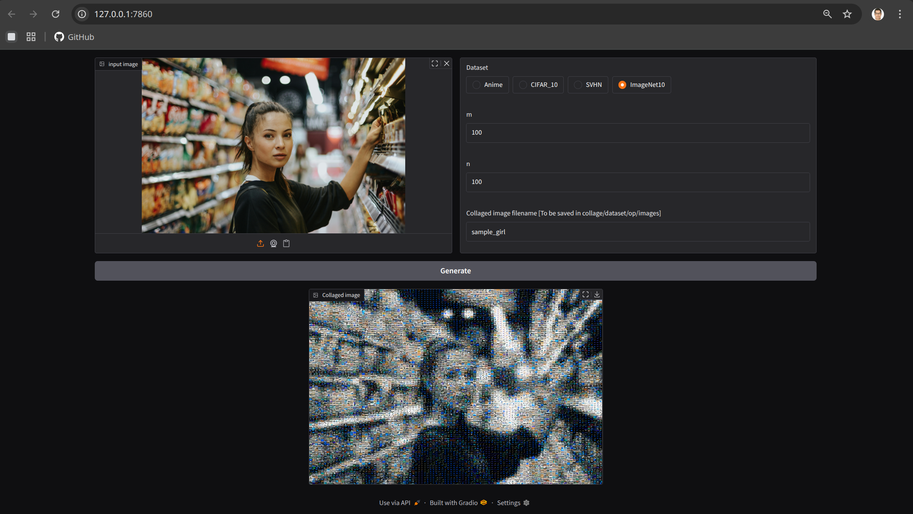
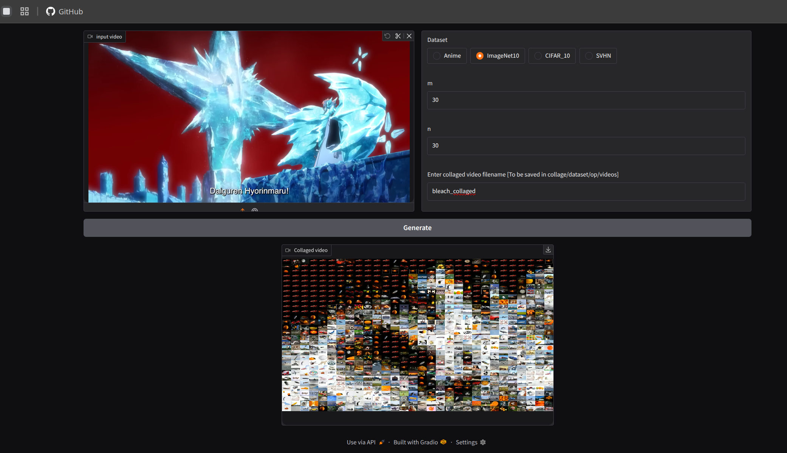

# collage

Turn your images and videos into dataset shadows.

## Datasets available:

1. Anime
2. ImageNet10
3. SVHN
4. CIFAR_10

## Samples

## Image

Original Picture

Anime with 10000 grids

ImageNet10 with 10000 grids

SVHN with 10000 grids

CIFAR_10 with 10000 grids

## Video

Original Video

ImageNet video with 900 Grids

## Usage

### Download the datasets

In dataset, run the **download_data_grdive.py**

`python3 download_data_gdrive.py`

### UI for images

In collage, run **gradio_app_img.py**

`python3 gradio_app_img.py`

Copy the local server link and paste it in your browser to work in the interface

### UI for videos

In collage, run **gradio_app_img.py**

`python3 gradio_app_img.py`

Copy the local server link and paste it in your browser to work in the interface

### For Pro users only

### Images

Edit the **start_collage_img.bash** according to your needs. Then run it.

`bash start_collage_img.bash`

### Videos

Edit the **start_collage_vid.bash** according to your needs. Then run it.

`bash start_collage_vid_batch.bash`

### Remarks

Wondering why the **gradio_app_vid.py** and **start_collage_vid.bash** is there for?
It doesn't process your videos in batches so your 10s video will take 10 days to be ready.

