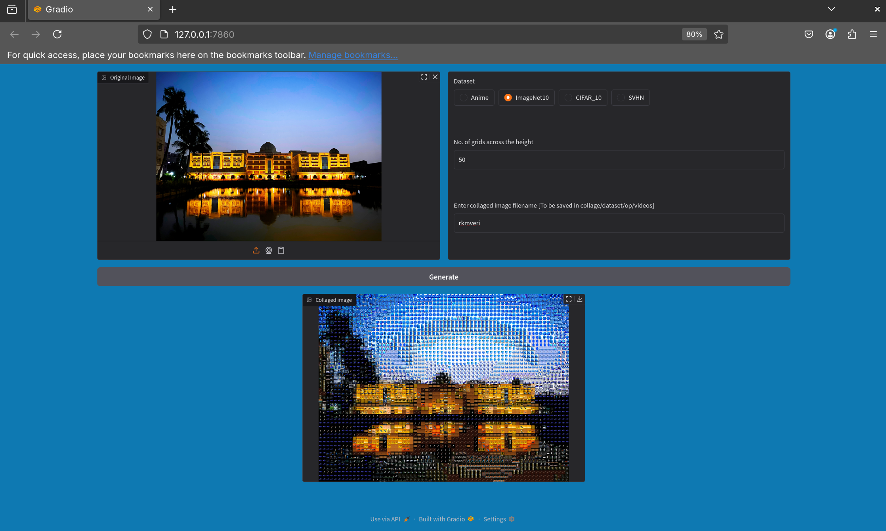

# Collager

Collager turns your images and videos to dataset collages, with a Gradio UI.
The original image is broken into patches and is replace with nearest neighbouring dataset image with respect to the mean pixel value of the three channels. 

# Datasets 

1. Anime
2. ImageNet10
3. SVHN
4. CIFAR_10

# Sample

## Image

Original Picture of RKMVERI

Anime with 50 grids across the height. Zoom into the picture to see the Anime dataset images that replaced your image grids.

ImageNet10 with 50 grids across the height. Zoom into the picture to see ImageNet10 images.

SVHN with 50 grids. Zoom into the picture to see SVHN images.

CIFAR_10 with 50 grids across the height. Zoom into the picture to see CIFAR_10 images.

## Video

Original Video

ImageNet video with 100 grids across the height.

# Prerequisites

## Install the packages required

From working directory, run `pip install -r requirements.txt`

## Creation of processed datasets

In the dataset folder, run **create_datasets.py**

`python3 create_datasets.py`

# Usage with Gradio UI 

## Image

In collage, run **gradio_app_img.py**

`python3 gradio_app_img.py`

Copy the local server link and paste it in your browser to work in the interface

## Video

In collage, run **gradio_app_img.py**

`python3 gradio_app_img.py`

Copy the local server link and paste it in your browser to work in the interface

# Conclusion 

This is my first open source project. I thank my brother <a href = "https://jimut123.github.io/">Jimut</a> for giving me the idea of this project and <a href = "https://cs.rkmvu.ac.in/~sp/">Sw. Punyeshwarananda</a>, HOD, Dept. of Computer Science, RKMVERI for providing suggestions for improvements. 